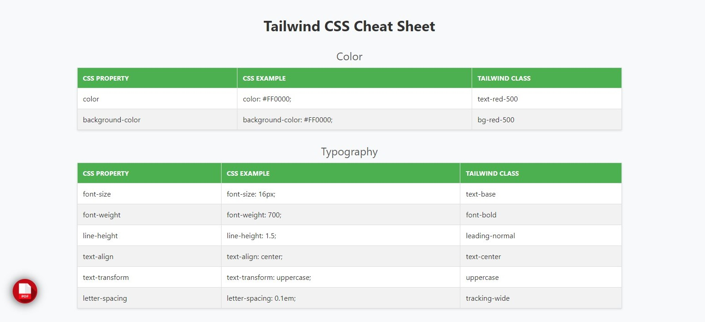

# Tailwind CSS Cheat Sheet

This repository contains a dynamic cheat sheet for Tailwind CSS properties, built using HTML, CSS, and JavaScript. It provides a categorized view of common CSS properties along with their Tailwind CSS equivalents.

## Table of Contents

- [Features](#features)
- [Usage](#usage)
- [Contributing](#contributing)

## Features

- Display and compare CSS properties and their corresponding Tailwind CSS classes.
- Styled table for easy readability and understanding.
- Responsive design for viewing on various devices.

## Usage
Each category (like color, typography, flexbox, etc.) contains examples of CSS properties and their Tailwind CSS classes.

To contribute, follow these steps:

1. Fork the repository.
2. Clone the forked repository to your local machine.
3. Add or update data in the `data` variable in `script.js` with additional Tailwind CSS properties.
4. Test your changes locally by opening `index.html` in your browser.
5. Commit your changes and push them to your forked repository.
6. Create a pull request with a clear description of your contribution.

Contributions are welcome! If you have suggestions, enhancements, or new categories to add, feel free to open an issue or submit a pull request. Your contributions can help improve this resource for everyone learning Tailwind CSS.

## License

This project is licensed under the MIT License - see the [LICENSE](LICENSE) file for details.
